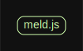

# 源码分析

## 文件结构

``` bash
/Users/liufang/openSource/FunnyLiu/meld
├── CHANGES.md
├── LICENSE.txt
├── README.md
├── aspect
|  ├── cache.js
|  ├── memoize.js
|  └── trace.js
├── bower.json
├── docs
|  ├── TOC.md
|  ├── api.md
|  ├── aspects.md
|  └── reference.md
├── meld.js
├── package-lock.json
├── package.json

directory: 718 file: 5325

ignored: directory (117)

```

## 外部模块依赖

请在： http://npm.broofa.com?q=meld 查看

## 内部模块依赖


  